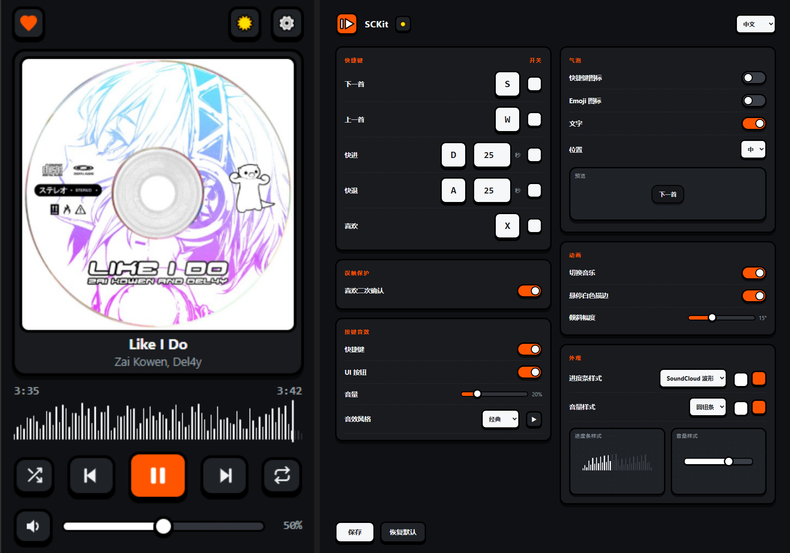

# SCKit · SoundCloud 单键遥控

一只手不离键盘，遥控 SoundCloud。

 

## 快捷键

| 键 | 动作 |
|:--:|------|
| `S` | 下一首 |
| `W` | 上一首 |
| `D` | 快进 25s |
| `A` | 快退 25s |
| `X` | 喜欢 / 取消喜欢（二次确认防误触） |
| `空格` | 播放 / 暂停（弹窗内） |

- 键位、快进秒数、单键开关全部可在设置页自定义，弹窗与页面即时同步
- 非拉丁键盘布局（俄文/法文等）按物理键位识别，无需切换输入法

## 弹窗迷你遥控器

点击工具栏图标：播放/暂停、切歌、随机、循环、静音、音量拖动、进度拖动、喜欢——
不用回到 SoundCloud 标签页。

- 暂停时封面灰化、控件变暗，一眼可辨播放状态
- 按键音效：6 种风格 + 自定义频率，试听即选
- 气泡提示：按键图标 / Emoji / 文字三开关，位置可调
- 深浅主题、中英双语

## 隐私

**零网络请求。** 不收集、不上传、不同步任何数据，所有配置只存在你的浏览器本地。
权限仅 `storage` 一项，仅作用于 soundcloud.com。

## 安装

1. 下载本仓库（Code → Download ZIP）并解压
2. 打开 `chrome://extensions`，右上角开启「开发者模式」
3. 「加载已解压的扩展程序」→ 选择解压后的文件夹

## 许可

[MIT](LICENSE)
